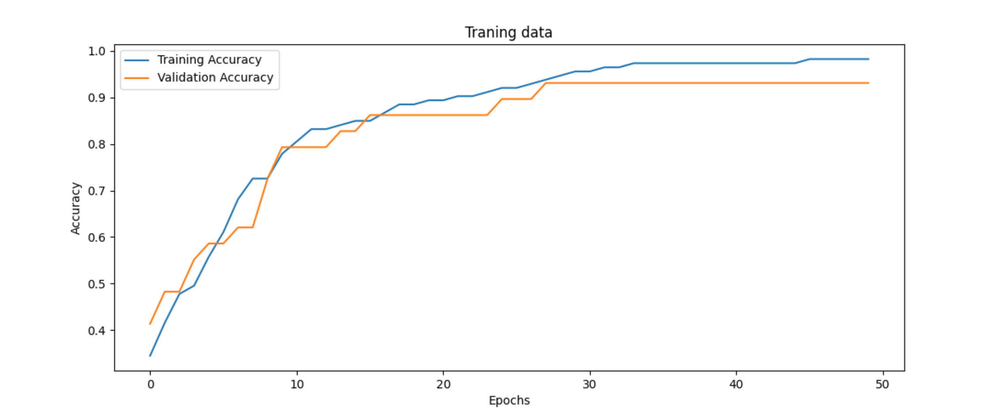
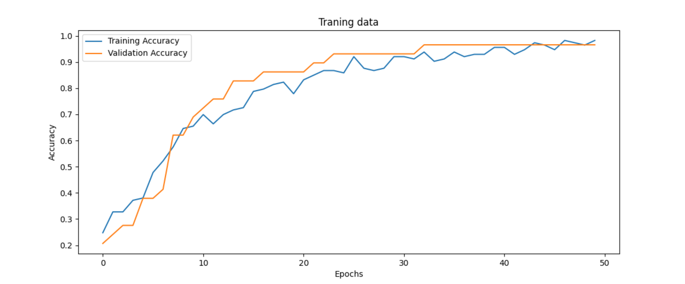

1. Opis modeli

Model 1

Prosty model, szybki w uczeniu jest naszym naszym punktem odniesienai.

Model 2

Model ma więcej warst, różne typy aktywacji i regularyzację, co pozwala mu  uczyć się lepiej.

2. Krzywe uczenia

Model 1

Dokładność: 94% - model szybko osiąga wysoką dokładność, bez większych wachań

Model 2

Dokładność: 97% - model szybciej osiąga wysoką dokładność, ale ma większe wachania

3. Wnioski

Lepszy wynik osiągnął model 2 dzięki większej ilości warstw, dropoutowi i różnym funkcjom aktywacji przez co jest bardziej elastyczny i odporny na przeuczenie.